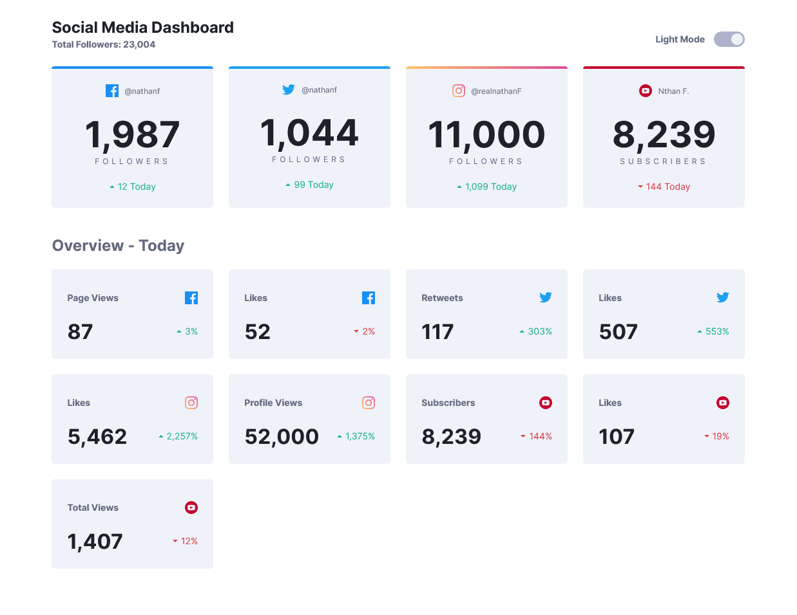
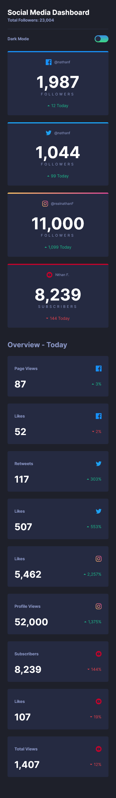

# Frontend Mentor - Social media dashboard with theme switcher solution

This is a solution to the [Social media dashboard with theme switcher challenge on Frontend Mentor](https://www.frontendmentor.io/challenges/social-media-dashboard-with-theme-switcher-6oY8ozp_H). Frontend Mentor challenges help you improve your coding skills by building realistic projects.

- [Frontend Mentor - Social media dashboard with theme switcher solution](#frontend-mentor---social-media-dashboard-with-theme-switcher-solution)
  - [Overview](#overview)
    - [The challenge](#the-challenge)
    - [Screenshot](#screenshot)
    - [Links](#links)
  - [My process](#my-process)
    - [Built with](#built-with)
    - [What I learned](#what-i-learned)
    - [To work on](#to-work-on)
  - [Author](#author)

## Overview

### The challenge

Users should be able to:

- View the optimal layout for the site depending on their device's screen size
- See hover states for all interactive elements on the page
- Toggle color theme to their preference

### Screenshot


<br>


### Links

- Solution URL: https://www.frontendmentor.io/solutions/social-media-dashboard-built-with-react-5UvBZV-Z3
- Live Site URL: https://jasweeney-social-media-dashboard.netlify.app/

## My process

Built with [React](https://reactjs.org). This is my first project built on my own with React. I also used [SASS](https://sass-lang.com/) and [BEM](http://getbem.com/) naming conventions.

### Built with

- CSS custom properties
- Flexbox
- CSS Grid
- SASS
- BEM
- Mobile-first workflow
- [React](https://reactjs.org/) - JS library

### What I learned

There were two main challenges with this project. I challenged myself by pretending I was getting the data for this page from an API. I created a file called `socialData.js` that mimics an API call. I purposely structured the data so that it would be challenging to manipulate the data to fit the site's needs. So the challenge here was taking data out of `socialData.js` and creating new data objects (see `updatedData.js`) that I could then store in `App.js`'s state. I then passed each child component only the data they needed as props. I'm not positive if there was a better structure for this... maybe I didn't need to store everything in `App`'s state. But it seemed to work fine to make `App` the only class component.

The other challenge was to create a theme switcher. I used custom css properties (css variables) stored in an object in a separate file. Here's a glimpse:

```js
const themes = {
  light: {
    "--card-bg-color": "hsl(227, 47%, 96%)",
    "--font-color-1": "hsl(228, 12%, 44%)",
    "--font-color-2": "hsl(230, 17%, 14%)",
    "--header-border-bottom": "hsl(230, 19%, 60%)",
  },
  dark: {
    "--card-bg-color": "hsl(228, 28%, 20%)",
    "--font-color-1": "hsl(228, 34%, 66%)",
    "--font-color-2": "hsl(0, 0%, 100%)",
    "--header-border-bottom": "hsl(228, 25%, 27%)",
  },
};
```

I stored all the "light" properties in my `index.css` file as well which served as the default values.

I then stored the themes data in state and also assigned the `currentTheme` to "Light".

Okay, so there's probably a more "React" way to do this but here's how I handled switching the theme.

```js
  themeSwitcher() {
    if (this.state.currentTheme === "Light") {
      let theme = this.state.themes.dark;
      for (const property in theme) {
        document.documentElement.style.setProperty(property, theme[property]);
      }
      this.setState({ currentTheme: "Dark" });
    } else {
      let theme = this.state.themes.light;
      for (const property in theme) {
        document.documentElement.style.setProperty(property, theme[property]);
      }
      this.setState({ currentTheme: "Light" });
    }
  }
```

`docuement.documentElement.style.setProperty()` is vanilla js that takes a key, value (property, attribute) pair. I'm proud of how I wrote this to ensure that if I add new custom props to my `theme.js` file, this method automatically handles those.

Finally, I think the switch button looks pretty slick! I ended up making this an scss mixin:

```scss
@mixin switch($toggle-on, $toggle-off, $height) {
  &__switch-outer {
    border-radius: $height;
    width: $height * 2;
    height: $height;
    border: none;
    background: $toggle-on;
    position: relative;
    cursor: pointer;
  }

  &__switch-inner {
    width: $height * 0.75;
    height: $height * 0.75;
    border-radius: 50%;
    background-color: $toggle-off;
    position: absolute;
    right: $height * 0.125;
    top: $height * 0.125;
    transition: all 250ms ease-in-out;

    &--on {
      transform: translateX(-$height);
    }
  }
}
```

### To work on

I couldn't quite figure out how to store the chosen theme into local storage given how I set up my method with custom css properties. These two blog posts could be useful for something like this in the future:

https://medium.com/@haxzie/dark-and-light-theme-switcher-using-css-variables-and-pure-javascript-zocada-dd0059d72fa2

https://programmingwithmosh.com/react/localstorage-react/

## Author

- Website - [Jimmy Sweeney](https://jimmysweeney.page/)
- Frontend Mentor - [@sweenejp](https://www.frontendmentor.io/profile/sweenejp)
- [Github](https://github.com/sweenejp)
